# 8150 Custom Nuke Nodes

This project was an introduction to creating custom nodes for Nuke.

## Build Instructions

- Build with `make` from the project root.
- Copy the resulting `.so` files into `~/.nuke/`.
- Update `menu.py` as needed so Nuke can load the nodes.
- Copy the new `menu.py` into `~/.nuke/`

## Cato Nodes
The following images were used as test photos:
- 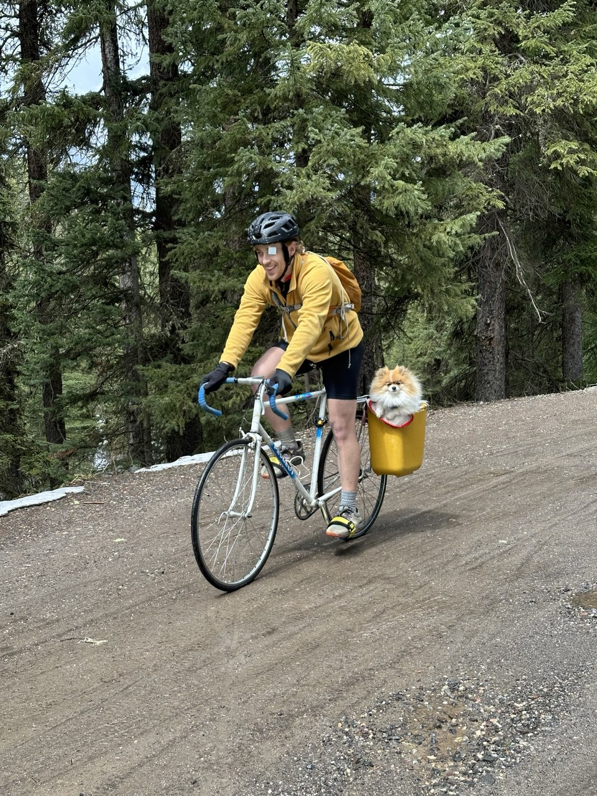
- 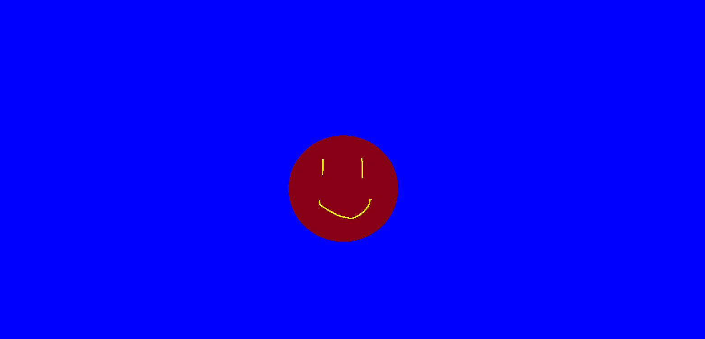
- 

### CatoColorDifference
 
- Purpose: Place a foreground image shot over a bluescreen over a background image.
- Inputs: 2
- Results:
	- 
	- 
- Notes:
	- This node places a foreground image onto a background by creating a matte based on the difference in colors of the foreground image and the background. The current implementation works only for a blue background, but could be modified to work for either blue or green backgrounds. 
    - Spill suppression is achieved on the foreground image (input 1), by creating a spill supressed blue which is the min of the blue and green channel of each pixel in the foreground image. 
    - A matte is then created by `std::max(*input1_b - std::max(*input1_r, *input1_g), 0.0f);`. This effectively makes the blue background white and the foreground element black. 
    - An over operation is then performed by `*outptr_r/g/b = matte * *input0_r/g/b + inverse_matte * *input1_r/g/spill_supress_b;`

### CatoOver
- Purpose: place one image over the next
- Inputs: 2
- Results:
	- 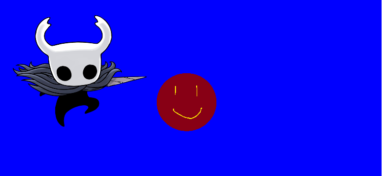
- Notes:
    - Unlike the Color Difference, the foreground image must already have an alpha of 0 on all areas but the foreground element. Otherwise the foreground image is fully drawn over the background image. 
    - `*outptr++ = (1.0 - *alpha1++ ) * *input0++ + *input1++;`

### CatoContrast

- Purpose: adjusts image contrast.
- Inputs: 1
- Results:
	- 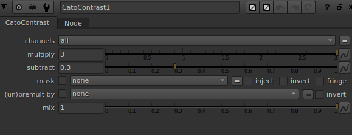
	- 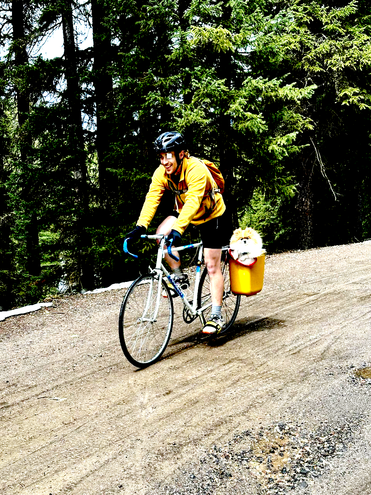
	- 
- Notes:
	- Very simple. Just `*outptr++ = mult * *inptr++ - subtract;`

### CatoEdge

- Purpose: basic edge detection.
- Inputs: 1
- Results:
	- 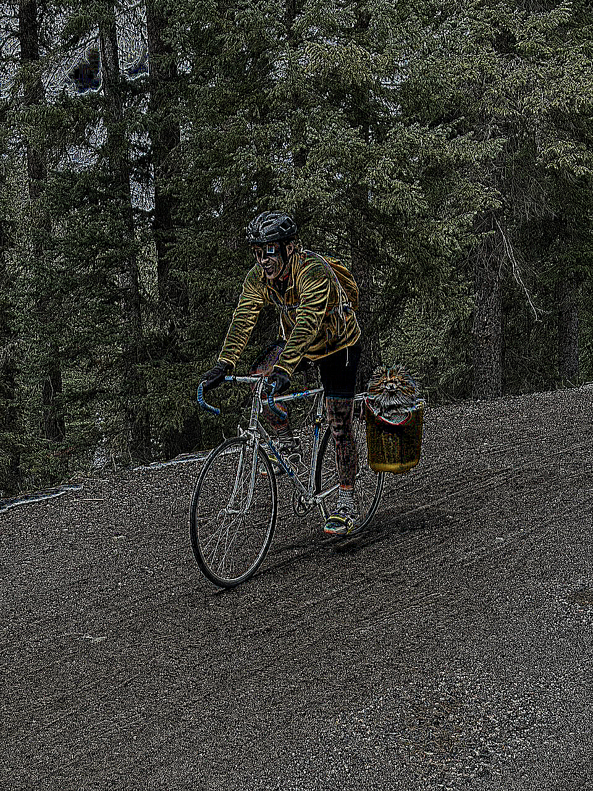
	- 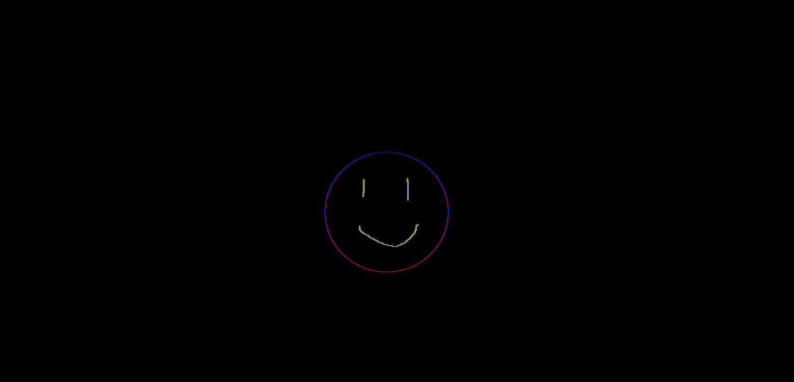
	- 
- Notes:
	- This is a really simple edge detection with the filer.
    ```
    double _filter[9] = {
        -1.0, -1.0, -1.0,
        -1.0,  8.0, -1.0,
        -1.0, -1.0, -1.0
    };
    ```
    - Nuke's Tile is then used to access the pixels around the target, allowing us to querry the values of neighboring pixels. 
    - The results are less than ideal for a photo with a lot of varying values per pixel. But for a simple image with very sharp contrast like the test smiley face, it works wel. 

### CatoGamma

- Purpose: gamma adjustment.
- Inputs: 1
- Results:
	- 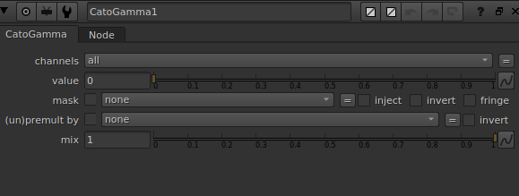
	- 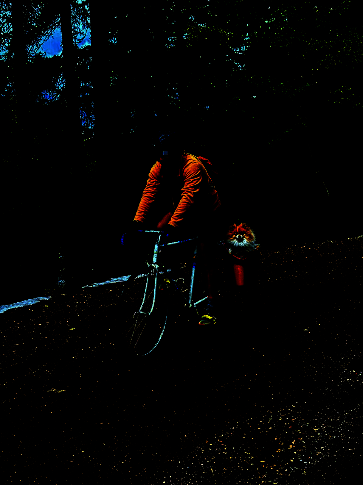
	- 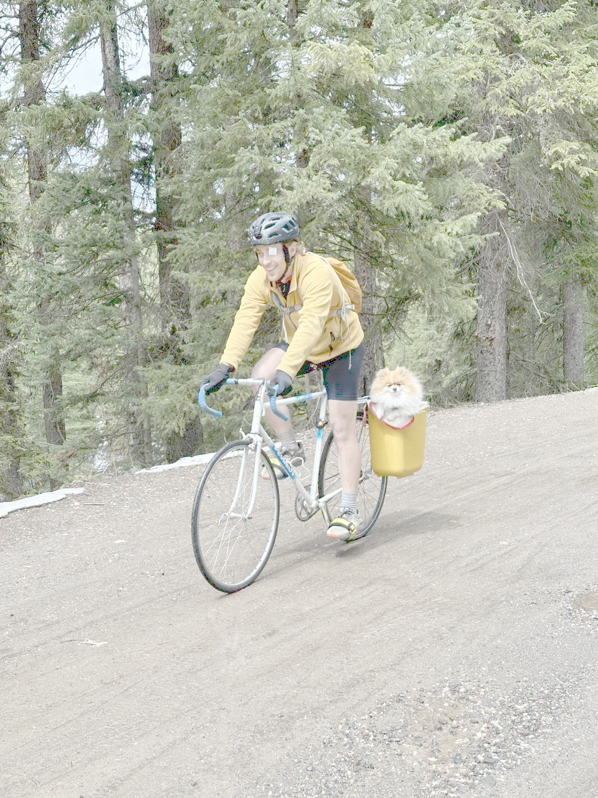
	- 
- Notes:
	- `*outptr++ = pow(*inptr++, gamma);`

### CatoMedian

- Purpose: median filter for noise reduction.
- Inputs: 1
- Results:
	- 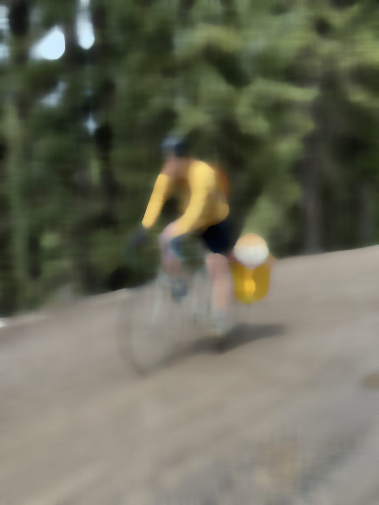
	- 
- Notes:
	- Confirm whether `edian_result.png` should be renamed to `median_result.png`.
	- Document the kernel size behavior.

### CatoOver

- Purpose: composits one image over another.
- Inputs: 2
- Results:
	- 
	- 
- Notes:
	- Gathers all of the values within a Tile of size 20, sorts them, then grabs the median value. 

### CatoSharpen

- Purpose: sharpens the image.
- Inputs: 1
- Results:
	- 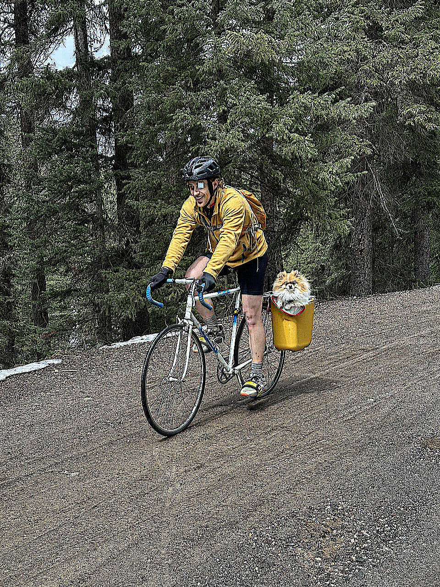
	- 
- Notes:
	- Just like the edge detect except the filter is:
    ```
    double _sharpen_filter[9] = {
        -1.0, -1.0, -1.0,
        -1.0,  9.0, -1.0,
        -1.0, -1.0, -1.0
    };
    ```

